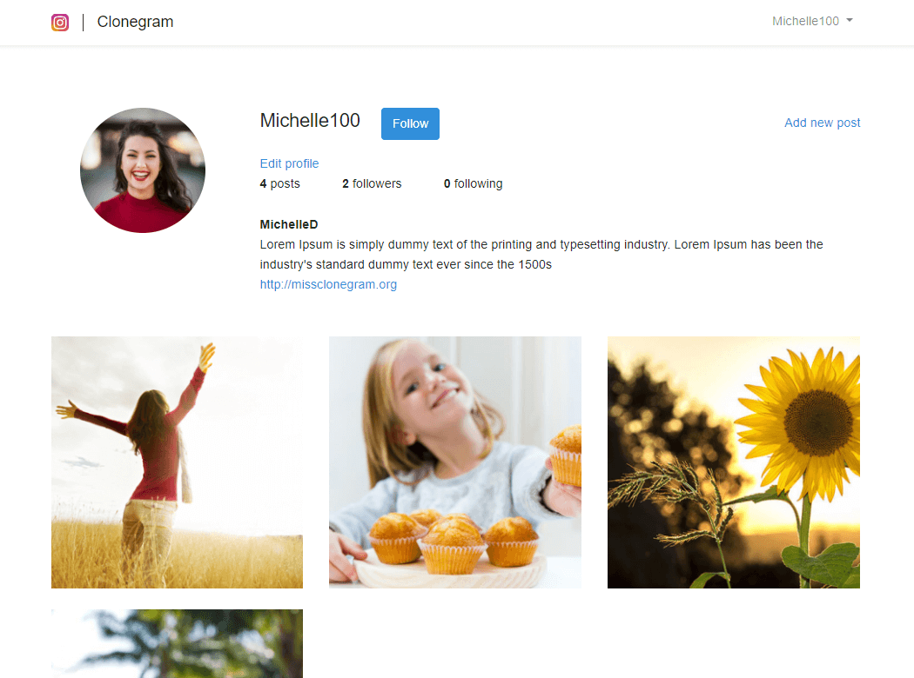

# Clonegram

> Clonegram is a laravel project which resemples Instagram.

## Built With

- PHP 8.0.1
- Laravel 8.29.0

## Getting Started

To get a local copy up and running follow these simple example steps.

### Prerequisites

- PHP 8.0.1
- Laravel 8.29.0

### Setup

- Clone this project running `git clone git@github.com:me-skit/clonegram-lrvl.git`.
- Enter the clonegram-lrvl folder.
- Create a database in your prefered database and set it up in the .env file.
- Run the migration `php artisan migrate`.
- Run a develop server `php artisan serve`.
- Open the localhost:8000 in your favorite browser, at first you will see a login form, but you have to register users first, hit the link an register some users.

## Authors

👤 **Meme**

- Github: [@me-skit](https://github.com/me-skit)
- Twitter: [@meme_es](https://twitter.com/meme_es)
- Linkedin: [Manuel](https://www.linkedin.com/in/manuel-elias/)

## 🤝 Contributing

Contributions, issues and feature requests are welcome!

Feel free to check the [issues page](https://github.com/me-skit/clonegram-lrvl/issues).

## Show your support

Give a ⭐️ if you like this project!

## 📝 License

This project is unlicensed.
